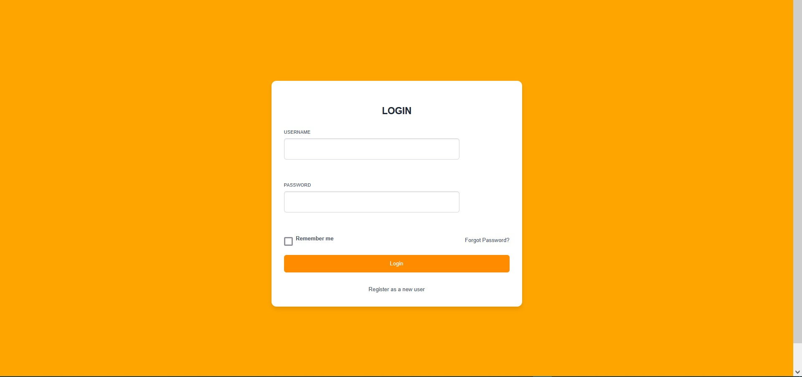
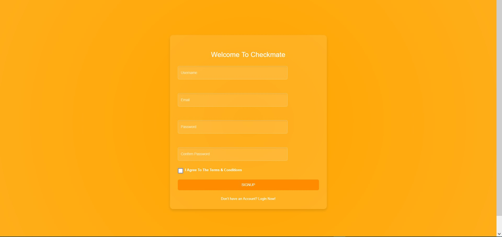
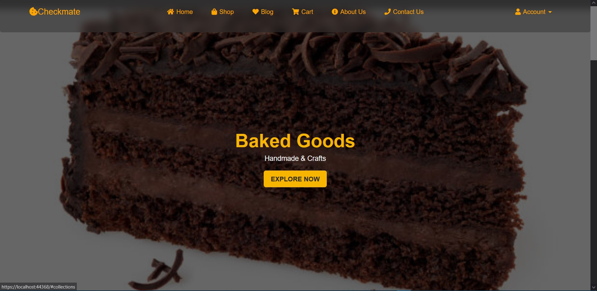
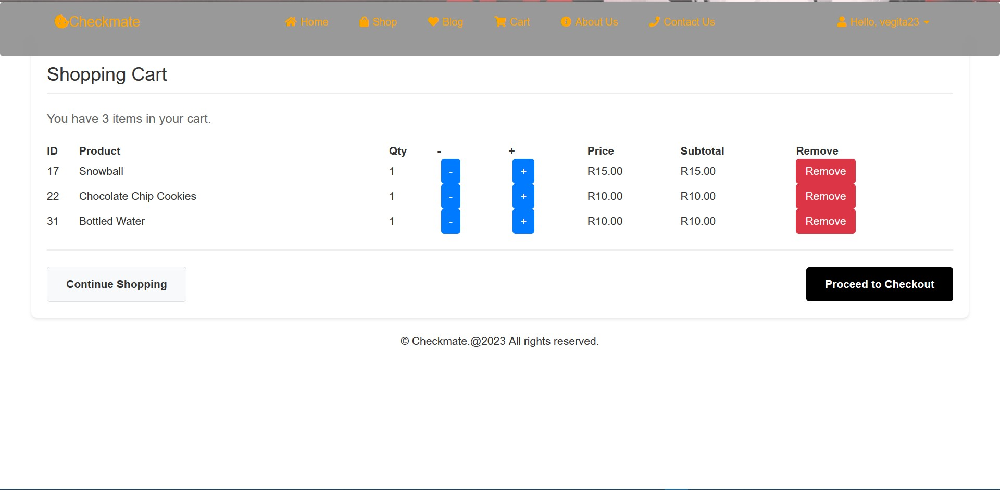
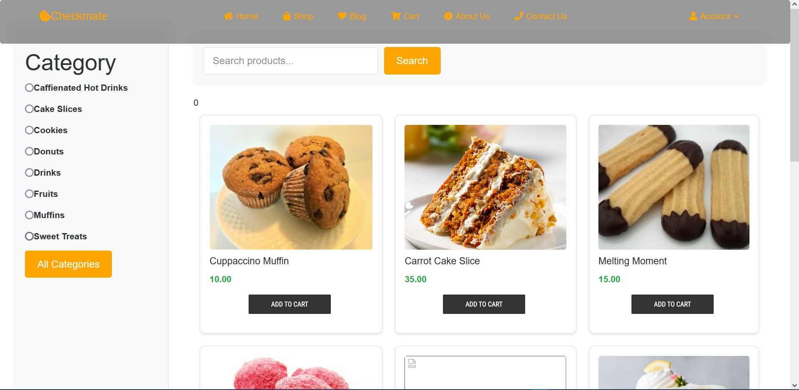

# 🍞 Bakery E-Commerce Website

This is a dummy **bakery e-commerce website** pages for the website built using **ASP.NET Web Forms, C#, and SQL Server**. Users can browse products, place orders, and track their purchase history. Admins can manage customers, inventory, and reports.

## Features
- 🔐 **User Authentication** (Register, Login, Forgot Password)
- 🛒 **Shopping Cart & Checkout**
- 📜 **Order History & Order Details**
- 📊 **Admin Dashboard** (Clients, Inventory Management, Reports)
- 📈 **Power BI Reports** (Sales Data, BestSelling, Inventory Report...)

## Tech Stack
- **Frontend:** HTML, CSS, JavaScript, Bootstrap
- **Backend:** ASP.NET (C#), SQL Server
- **Reports:** Power BI
- **Version Control:** Git & GitHub

## 📸 Screenshots

### Login and Sign up pages

### 🏠 Homepage

### 🛒 Shopping Cart

### 📊 Product Page

